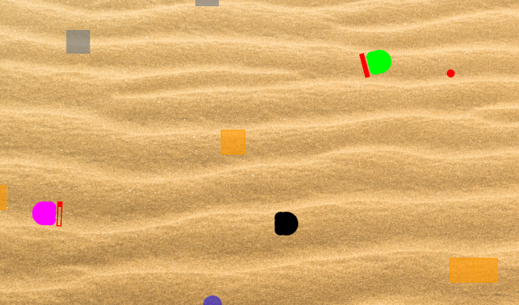
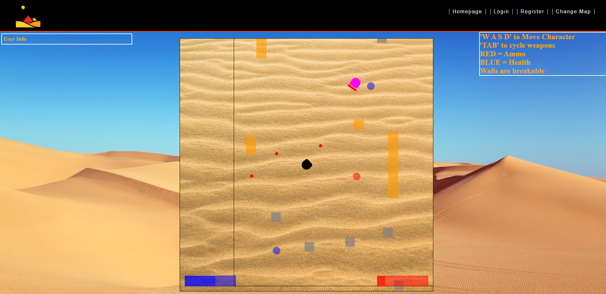
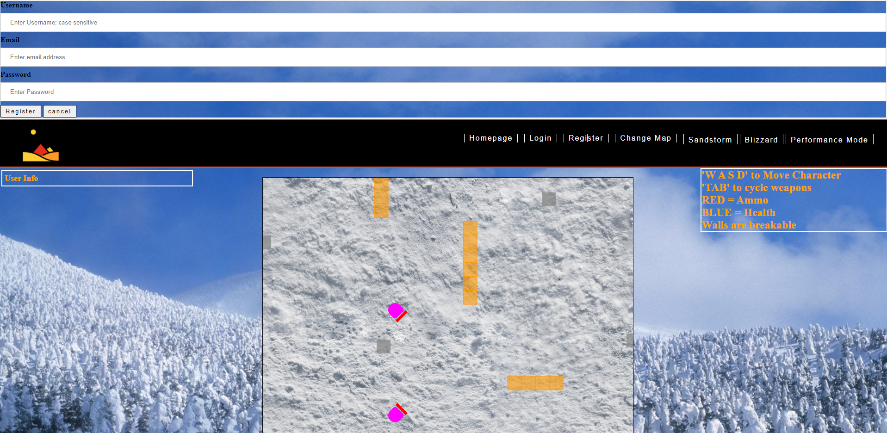

# js-shooter
Fullstack 2D shooting game with a movable character and various enemy/item classes
-includes CRUD user system 
-Sign up and register components
-SQL DB keeps track of user scores 

# Additional Features: 

  -Obstacles can be destroyed \n
  -Multiple types of AI, and multiple opponents \n
  -Multiple projectiles; Shotgun  \n
  -Multiple Weapons
  -Enemy Health Bars  
  -Map change 

